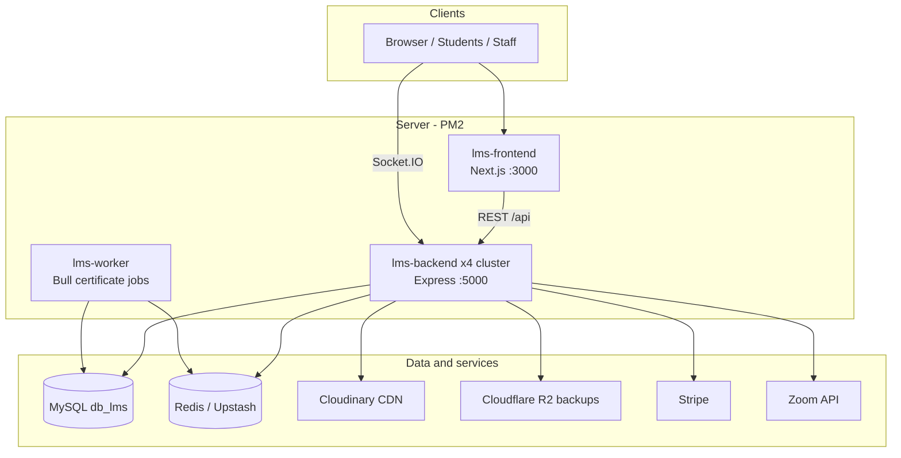

# Inspire LMS — Complete Project Overview (A to Z)

**Product:** Inspire London College Learning Management System (LMS)  
**Repository path:** `/var/www/lms-app`  
**Production URL:** `https://lms.inspirelondoncollege.com`  
**Last documented:** May 2026  

This document is a single A–Z reference for stack, dependencies, dashboards, storage, caching, deployment, and architecture. For role-by-role API and table detail, see also [`LMS_COMPLETE_SPECIFICATION.md`](./LMS_COMPLETE_SPECIFICATION.md).

---

## Table of contents

1. [What this project is](#1-what-this-project-is)
2. [High-level architecture](#2-high-level-architecture)
3. [Technology stack](#3-technology-stack)
4. [Repository layout](#4-repository-layout)
5. [Frontend (Next.js)](#5-frontend-nextjs)
6. [Backend (Express API)](#6-backend-express-api)
7. [All user roles](#7-all-user-roles)
8. [Dashboards and routes (complete map)](#8-dashboards-and-routes-complete-map)
9. [Student onboarding (wizard)](#9-student-onboarding-wizard)
10. [Authentication and authorization](#10-authentication-and-authorization)
11. [Database (MySQL)](#11-database-mysql)
12. [Storage systems](#12-storage-systems)
13. [Cache and Redis usage](#13-cache-and-redis-usage)
14. [Background jobs and cron](#14-background-jobs-and-cron)
15. [Real-time (Socket.IO)](#15-real-time-socketio)
16. [External integrations](#16-external-integrations)
17. [Deployment (PM2 / Nginx)](#17-deployment-pm2--nginx)
18. [Environment variables (categories)](#18-environment-variables-categories)
19. [Security and rate limiting](#19-security-and-rate-limiting)
20. [Key feature modules](#20-key-feature-modules)
21. [Dependencies reference](#21-dependencies-reference)
22. [Related documentation](#22-related-documentation)

---

## 1. What this project is

Inspire LMS is a full-stack **learning management platform** for Inspire London College. It supports:

- **CPD courses** (quizzes, certificates, progress)
- **Qualification courses** (units, assignments, presentations, quizzes, assessor grading, refer/pass workflow)
- **Student onboarding** (documents, VARK, admin verification)
- **Payments** (Stripe installments, finance dashboards)
- **Support tickets** (department routing: Academic, Finance, Support)
- **Direct chat** and **ticket-linked conversations**
- **Consultation booking** (Zoom, Consultation Manager role)
- **Certificate generation** (templates, PDF pipeline, claim manager)
- **Forum**, **notifications**, **AI automation tokens** (admin)
- **Database backups** to Cloudflare R2

The app is **not** a monolith: it runs as **Next.js frontend** + **Express API** + **certificate worker**, orchestrated by **PM2**.

---

## 2. High-level architecture



| Layer | Technology |
|-------|------------|
| UI | Next.js 16 (App Router), React 19, TypeScript, Tailwind CSS 4 |
| API | Node.js, Express 5 |
| DB | MySQL (`mysql2`, raw SQL, no ORM) |
| Primary file CDN | Cloudinary |
| Backup storage | Cloudflare R2 (S3-compatible API) |
| Payments | Stripe |
| Real-time | Socket.IO (+ optional Redis adapter for cluster) |
| Queue | Bull (Redis-backed) for certificates |
| Process manager | PM2 (`ecosystem.config.js`) |

---

## 3. Technology stack

### 3.1 Frontend

| Area | Choice |
|------|--------|
| Framework | Next.js 16.1.x (`app/` directory, App Router) |
| UI library | React 19 |
| Language | TypeScript 5 |
| Styling | Tailwind CSS 4 (`@tailwindcss/postcss`) |
| Font | Geist Sans (`geist` package) |
| Icons | `react-icons`, `lucide-react` |
| Charts | `recharts` |
| Rich text | Quill 2 (`quill`, `NativeQuillEditor`, `QuillFeedbackEditor`) |
| Alerts | SweetAlert2 |
| Motion | Framer Motion |
| Payments UI | `@stripe/react-stripe-js`, `@stripe/stripe-js` |
| Real-time client | `socket.io-client` |
| Loading bar | `nextjs-toploader` |
| DOCX / certificates (client helpers) | `docxtemplater`, `pizzip`, `mammoth`, `html-docx-js`, `libreoffice-convert` |

### 3.2 Backend

| Area | Choice |
|------|--------|
| Runtime | Node.js |
| HTTP | Express 5 |
| DB driver | `mysql2` (connection pool) |
| Auth | `jsonwebtoken`, `bcrypt` |
| Validation | `express-validator` |
| Security | `helmet`, `cors`, `express-rate-limit`, `rate-limit-redis` |
| Uploads | `multer`, `multer-storage-cloudinary` |
| Media | `cloudinary` |
| Backup object storage | `@aws-sdk/client-s3` (R2) |
| Email | `nodemailer` |
| HTML sanitize | `sanitize-html` |
| PDF | `pdfkit` |
| Logging | `pino`, `pino-pretty` |
| Scheduling | `node-cron` |
| Queue | `bull` |
| Real-time | `socket.io`, `@socket.io/redis-adapter` |
| Geo (dev/test) | `geoip-lite` |
| Env | `dotenv` / `@dotenvx/dotenvx` |

### 3.3 Infrastructure (typical production)

- **OS:** Linux (e.g. Ubuntu on VPS)
- **Reverse proxy:** Nginx (TLS termination, proxy `/api` → backend, `/` → Next.js)
- **Processes:** PM2 — 4× API cluster, 1× frontend, 1× worker
- **Redis:** Upstash or self-hosted (TLS `rediss://`)
- **MySQL:** `db_lms` database

---

## 4. Repository layout

```
/var/www/lms-app/
├── app/                          # Next.js App Router (frontend)
│   ├── components/               # Shared UI (50+ components)
│   ├── dashboard/                # Role-based dashboards (see §8)
│   ├── onboarding/               # Student onboarding wizard
│   ├── services/                 # api.ts — central HTTP client
│   ├── utils/                    # linkify, apiUrl, authStorage, gradingDeadline
│   ├── layout.tsx                # Root layout + globals.css
│   ├── page.tsx                  # Login / home
│   └── globals.css               # Tailwind + global styles
├── backend/
│   ├── server.js                 # Express entry + route mounting
│   ├── socket.js                 # Socket.IO initialization
│   ├── config/                   # db.js, redis.js, cloudinary.js, logger.js
│   ├── routes/                   # 34 route modules
│   ├── controllers/              # ticketController, chatController, …
│   ├── middleware/               # auth, roles, cache, rateLimiter, activityLogger
│   ├── services/                 # certificateGenerator, r2Service, studentQualProgress, …
│   ├── workers/                  # certificateWorker.js
│   ├── queues/                   # certificateQueue.js (Bull)
│   ├── cron/                     # backups, reminders, log rotation, consultations
│   ├── migrations/               # SQL migrations (~47 files)
│   ├── uploads/                  # Legacy static files only
│   └── logs/                     # PM2 log output
├── docs/
│   ├── LMS_COMPLETE_SPECIFICATION.md
│   └── PROJECT_OVERVIEW_A_TO_Z.md   # this file
├── ecosystem.config.js           # PM2: lms-backend, lms-frontend, lms-worker
├── next.config.ts
├── package.json                  # Frontend dependencies
└── backend/package.json          # Backend dependencies
```

---

## 5. Frontend (Next.js)

### 5.1 Entry and routing

- **Login:** `/` (`app/page.tsx`) — JWT stored as `lms-token`, user object as `lms-user` in `localStorage`
- **Dashboard hub:** `/dashboard` — redirects by role (see §8)
- **API base:** `app/services/api.ts` — `NEXT_PUBLIC_API_URL` or same-origin `/api` behind Nginx

### 5.2 Layout and guards

| Component | Purpose |
|-----------|---------|
| `ConditionalLayout` | Navbar/footer vs bare pages |
| `ProtectedRoute` / role checks | Page-level access by role array |
| `OnboardingGuard` | Blocks dashboard until onboarding complete |
| `AutoLogoutProvider` | Session timeout behavior |
| `FloatingChatProvider` / `FloatingChatWindow` | Global chat UI |
| `FloatingTicketProvider` | Quick ticket UI |
| `ImpersonationBanner` | Admin impersonation indicator |

### 5.3 Notable shared components

| Component | Purpose |
|-----------|---------|
| `ChatBox` | Conversation UI (images/PDF/file cards) |
| `SendMessageToStudentModal` | Staff-initiated ticket + first message |
| `StudentQualificationProgressView` | Unit tree (deadlines, 10-day rule, rejections) |
| `StudentPaymentsTab` / `PaymentManagementView` | Finance installments |
| `QuillFeedbackEditor` / `NativeQuillEditor` | Assessor grading feedback (HTML) |
| `MessageFileAttachment` | Ticket message file preview/download |
| `CertificateClaimsManagement` | Certificate manager workflows |
| `StudentsProfileView` | Cross-department student list + Send Message |

---

## 6. Backend (Express API)

### 6.1 Server bootstrap (`backend/server.js`)

- Listens on **`127.0.0.1:5000`** (Nginx proxies public HTTPS → this port)
- **Socket.IO** attached to same HTTP server
- **Stripe webhook** registered **before** `express.json()` (raw body)
- Body limit **200MB** (large qualification uploads)
- Global: CORS, Helmet, cookie-parser, rate limits, activity logger
- Legacy static: `/uploads` → `backend/uploads/`

### 6.2 API route map (prefix `/api`)

| Mount path | Module | Domain |
|------------|--------|--------|
| `/api/login`, `/api/auth` | `routes/auth.js` | Login, refresh, logout |
| `/api/users` | `routes/users.js` | User CRUD |
| `/api/courses` | `routes/courses.js` | Course catalog |
| `/api/admin` | `routes/admin.js` | Admin + nested tutor routes |
| `/api/tutor` | `admin.tutorRouter` | Assessor-specific admin APIs |
| `/api/student` | `routes/student.js`, `studentProfile.js` | Student learning, profile |
| `/api/onboarding` | `routes/onboarding.js` | Onboarding steps |
| `/api/documents` | `routes/documentVerification.js` | ID/CV doc verification |
| `/api/staff` | `routes/staffProfile.js` | Staff profiles |
| `/api/...` | `paymentInstallments.js` | Stripe, installments, webhooks |
| `/api/...` | `paymentReminders.js` | Reminders, email templates |
| `/api/chat` | `routes/chat.js` | Direct messaging |
| `/api/tickets` | `routes/tickets.js` | Support tickets, uploads, student progress |
| `/api/cpd` | `routes/cpd.js` | CPD courses |
| `/api/qualification` | `routes/qualification.js` | Qual units, submissions, grading |
| `/api/manager` | `routes/manager.js` | Manager role |
| `/api/forum` | `routes/forum.js` | Forum posts/comments |
| `/api/notifications` | `routes/notifications.js` | In-app notifications |
| `/api/...` | `consultations.js` | Zoom booking |
| `/api/consultation-manager` | `consultationManager.js` | CM dashboard APIs |
| `/api/consultation-messages` | `consultationMessages.js` | CM chat/files |
| `/api/claim-manager` | `claimManager.js` | Certificate claims queue |
| `/api/certificates` | `certificates.js` | Student certificate claims |
| `/api/certificate-templates` | `certificateTemplates.js` | Template CRUD |
| `/api/settings` | `settings.js` | Stripe mode, system settings |
| `/api/ai` | `ai.js` | AI token automation |
| `/api/admin/ai-security` | `ai-security.js` | AI security logs |
| `/api/admin/logs` | `logs.js` | System logs |
| `/api/backup` | `backup.js` | DB backup to R2 |
| `/api/email-templates` | `emailTemplates.js` | Admin email sends |
| `/api/health` | `health.js` | Health check |
| `/api/webhook` | Stripe (in server.js) | Payment webhooks |

---

## 7. All user roles

Roles are stored in MySQL `roles` and mapped in `backend/middleware/auth.js`:

| ID | Role name | Typical dashboard |
|----|-----------|-------------------|
| 1 | Admin | `/dashboard/admin` |
| 2 | Assessor | `/dashboard/tutor` (URL label “tutor”) |
| 3 | Manager | `/dashboard/manager` |
| 4 | Student | `/dashboard/student` |
| 5 | Moderator | `/dashboard/moderator` |
| 6 | Operation Manager | `/dashboard/tickets` (Academic dept) |
| 7 | Accounts Manager | `/dashboard/tickets` (Finance dept) |
| 8 | Administrative Manager | `/dashboard/tickets` |
| 9 | Admission Manager | `/dashboard/tickets` |
| 10 | Team Member | `/dashboard/tickets` |
| 11 | Certificate Manager | `/dashboard/certificate-manager` |
| 12 | Claim Manager | `/dashboard/claim-manager` |
| 13 | ManagerStudent | `/dashboard/student` (or managerStudent) |
| 14 | InstituteStudent | `/dashboard/student` |
| 15 | Consultation Manager | `/dashboard/consultation-manager` |

**Departments** (tickets): Academic (1), Finance (2), Support (3) — linked to Operation Manager, Accounts Manager, etc.

---

## 8. Dashboards and routes (complete map)

### 8.1 Role redirect (`/dashboard` and login)

| Role | Default route |
|------|----------------|
| Admin | `/dashboard/admin` |
| Assessor | `/dashboard/tutor` |
| Manager | `/dashboard/manager` |
| Moderator | `/dashboard/moderator` |
| Student / ManagerStudent / InstituteStudent | `/dashboard/student` (+ onboarding gates) |
| Certificate Manager | `/dashboard/certificate-manager` |
| Claim Manager | `/dashboard/claim-manager` |
| Consultation Manager | `/dashboard/consultation-manager` |
| Operation / Accounts / Admin / Admission Manager, Team Member | `/dashboard/tickets` |

### 8.2 Admin — `/dashboard/admin`

| Route | Purpose |
|-------|---------|
| `/dashboard/admin` | Main admin hub (users, courses, AI tokens, impersonation, …) |
| `/dashboard/admin/students/[studentId]` | Full student profile (tabs: profile, docs, payments, courses) |
| `/dashboard/admin/courses/[id]` | Course detail |
| `/dashboard/admin/cpd/create`, `cpd/[courseId]/manage`, `cpd/[courseId]/view` | CPD lifecycle |
| `/dashboard/admin/qualification/create`, `qualification/[courseId]/manage`, `view` | Qualification lifecycle |
| `/dashboard/admin/qualification/units/[unitId]/edit`, `view` | Unit editor |
| `/dashboard/admin/enrollments/[courseId]/[studentId]/setup` | Enrollment setup |
| `/dashboard/admin/consultations` | Consultation system admin |
| `/dashboard/admin/emails` | Email templates (Quill) |
| `/dashboard/admin/backup` | Database backups |
| `/dashboard/admin/import-moodle` | Moodle import tool |

### 8.3 Assessor (Tutor) — `/dashboard/tutor`

| Route | Purpose |
|-------|---------|
| `/dashboard/tutor` | Submissions queue, grading, team stats, **Grade Submission** (Quill) |
| `/dashboard/tutor/courses/[id]` | Course management |
| `/dashboard/tutor/students/[studentId]` | Student view for assessor |
| `/dashboard/tutor/cpd/*`, `qualification/*` | Parallel CPD/qual tools |
| `/dashboard/tutor/team/today/[subTutorId]` | Sub-tutor daily work |
| `/dashboard/tutor/team/all/[subTutorId]` | All submissions |
| `/dashboard/tutor/team/pending/[subTutorId]` | Pending |
| `/dashboard/tutor/team/feedback/[subTutorId]` | Feedback review |
| `/dashboard/tutor/enrollments/.../setup` | Enrollment |

### 8.4 Student — `/dashboard/student`

| Route | Purpose |
|-------|---------|
| `/dashboard/student` | Home, courses, notifications |
| `/dashboard/student/profile` | Profile + VARK |
| `/dashboard/student/grades` | **Tutor Feedback** viewer (HTML tables, Quill output) |
| `/dashboard/student/certificates` | My certificates |
| `/dashboard/student/consultations` | Book consultations |
| `/dashboard/student/courses/[id]` | Course entry |
| `/dashboard/student/cpd/[courseId]/*` | CPD learn, quiz, view, claim certificate |
| `/dashboard/student/qualification/[courseId]/view` | Qualification player |
| `/dashboard/student/qualification/[courseId]/claim-certificate` | Claim flow |

### 8.5 Tickets / departments — `/dashboard/tickets`

Shared by Operation Manager, Accounts Manager, Admission, Administrative, Team Member.

| Route | Purpose |
|-------|---------|
| `/dashboard/tickets` | Ticket inbox, stats, academic progress modal |
| `/dashboard/tickets/[id]` | Ticket thread + **MessageFileAttachment** |
| `/dashboard/tickets/new` | Create ticket |
| `/dashboard/tickets/students-profile` | All students list + **Send Message** |
| `/dashboard/tickets/student/[studentId]` | Staff student view (progress / payments / profile tabs) |
| `/dashboard/tickets/students` | Accounts-focused student list |
| `/dashboard/tickets/payments` | Payment management |
| `/dashboard/tickets/chat` | Chat entry |
| `/dashboard/tickets/courses` | Total courses (OM / team) |
| `/dashboard/tickets/team` | Team management |

### 8.6 Certificate Manager — `/dashboard/certificate-manager`

| Route | Purpose |
|-------|---------|
| `/dashboard/certificate-manager` | Claims, templates, generation |
| `/dashboard/certificate-manager/students/[studentId]` | Student certificate context |

### 8.7 Claim Manager — `/dashboard/claim-manager`

| Route | Purpose |
|-------|---------|
| `/dashboard/claim-manager` | Claim queue |
| `/dashboard/claim-manager/students/[studentId]` | Unit feedback export, student detail |

### 8.8 Consultation Manager — `/dashboard/consultation-manager`

| Route | Purpose |
|-------|---------|
| `/dashboard/consultation-manager` | Dashboard |
| `/dashboard/consultation-manager/today` | Today's calls |
| `/dashboard/consultation-manager/bookings` | Bookings |
| `/dashboard/consultation-manager/slots` | Slot management |
| `/dashboard/consultation-manager/students/[studentId]` | Student + **unit progress** |

### 8.9 Other roles

| Area | Routes |
|------|--------|
| Manager | `/dashboard/manager` |
| Moderator | `/dashboard/moderator` |
| ManagerStudent | `/dashboard/managerStudent` |
| Forum (shared) | `/dashboard/forum`, `/dashboard/forum/[postId]` |
| Operation Manager consultations | `/dashboard/operation-manager/consultations` |
| Global chat page | `/chat` (if routed) |

---

## 9. Student onboarding (wizard)

| Step | Path |
|------|------|
| Welcome | `/onboarding/welcome` |
| Course selection | `/onboarding/course-selection` |
| Qualification level | `/onboarding/qualification-level` |
| Documents | `/onboarding/documents` |
| Initial assessment | `/onboarding/initial-assessment` |
| VARK (often via profile) | `/onboarding/vark-assessment` or profile |
| Pending verification | `/onboarding/verification-pending` |
| Resubmit docs | `/onboarding/resubmit` |

Backend: `/api/onboarding/*`, `/api/documents/*` — statuses in `student_onboarding_status`, files on **Cloudinary**.

---

## 10. Authentication and authorization

| Mechanism | Detail |
|-----------|--------|
| Token | JWT in `Authorization: Bearer` + `lms-token` in browser storage |
| Secret | `JWT_SECRET` (min 32 chars, enforced at startup) |
| Password | `bcrypt` hashes in `users.password` |
| Logout / invalidate | Redis key `jwt_blacklist:<token>` |
| Middleware | `auth` → attaches `req.user`; `permit(...roles)` in routes |
| Impersonation | Admin can impersonate (banner + logs) |

Frontend sends credentials via `api.ts` (`credentials: 'include'` where needed).

---

## 11. Database (MySQL)

- **Database name:** `db_lms` (default from `DB_NAME`)
- **Access:** `mysql2` connection pool (`backend/config/db.js`)
- **Pattern:** Raw SQL — `pool.execute()` / transactions — **no Sequelize/Prisma**
- **Migrations:** `backend/migrations/*.sql` (~47 files) + some runtime `CREATE TABLE IF NOT EXISTS`

### Major table groups

| Group | Examples |
|-------|----------|
| Auth / users | `users`, `roles`, `student_profiles`, `staff_profiles` |
| Onboarding | `student_onboarding_status`, `student_documents`, `student_initial_assessments` |
| Courses | `courses`, `course_assignments`, `units`, `course_categories` |
| CPD | CPD-specific progress/quiz tables (see spec) |
| Qualification | `qual_unit_progress`, `qual_submissions`, `assignment_submission_files`, `qual_topics`, quizzes |
| Payments | `student_payment_installments`, Stripe-related fields |
| Tickets | `tickets`, `ticket_messages`, `departments`, `conversations`, `messages` |
| Chat | `conversations`, `messages`, participants |
| Consultations | Booking/slot tables (see `consultationManager` migrations) |
| Certificates | Claims, templates, generated PDF metadata |
| System | `notifications`, `system_logs`, settings, AI tokens |

Full table list: **§4 in `LMS_COMPLETE_SPECIFICATION.md`**.

---

## 12. Storage systems

### 12.1 Cloudinary (primary — user-facing files)

**Used for:** profile pictures, onboarding documents, course/qualification uploads, assignment files, ticket attachments, chat files, certificate assets, many admin uploads.

| Aspect | Detail |
|--------|--------|
| SDK | `cloudinary` + `multer` memory → `upload_stream` |
| Config | `backend/config/cloudinary.js` |
| Folder examples | `lms/tickets`, qualification folders per route |
| URLs | `secure_url` stored in DB columns (`file_path`, `file_url`, etc.) |
| Next.js images | `res.cloudinary.com` allowed in `next.config.ts` `remotePatterns` |

### 12.2 Legacy local uploads

| Aspect | Detail |
|--------|--------|
| Path | `backend/uploads/` served at `/uploads` |
| Status | **Backward compatibility only** — new uploads go to Cloudinary |

### 12.3 Cloudflare R2 (backups only)

| Aspect | Detail |
|--------|--------|
| Service | `backend/services/r2Service.js` |
| SDK | `@aws-sdk/client-s3` (S3-compatible API) |
| Bucket | `R2_BUCKET_NAME` (default `inspire-lms-backups`) |
| Keys | `backups/<filename>` |
| Trigger | Admin backup UI + `cron/databaseBackup.js` |

### 12.4 What is NOT stored on server disk (by design)

- New assignment submissions → Cloudinary URLs in DB  
- Ticket message attachments → Cloudinary  
- Generated certificate PDFs → typically Cloudinary or queue output paths (see certificate worker)

---

## 13. Cache and Redis usage

Redis client: **`ioredis`** (`backend/config/redis.js`) — typically **Upstash** with TLS (`rediss://`).

| Use case | Implementation | TTL / notes |
|----------|----------------|-------------|
| **HTTP response cache** | `middleware/cache.js` — `cacheMiddleware(duration)` on GET routes | Default 300s; key `cache:<url>:<query>` |
| **Cache invalidation** | `invalidateCache('cache:/api/tickets*')` after writes | SCAN + DEL batches |
| **JWT blacklist** | `jwt_blacklist:<token>` on logout | Until token expiry |
| **Rate limiting** | `rate-limit-redis` store | Per-IP / auth routes |
| **Socket.IO cluster** | `@socket.io/redis-adapter` (optional) | Cross-PM2 instance rooms |
| **Online presence** | `online_user:<userId>` in `socket.js` | TTL 120s, heartbeat refresh |
| **Bull queue** | `queues/certificateQueue.js` | Certificate PDF jobs |
| **Consultation booking** | Distributed locks in consultations routes | Prevents double-book |
| **Safe degradation** | `redis.safeRedis()` | API continues if Redis down |

**Important:** Cache is **not** a separate CDN layer for HTML — it caches **JSON API responses** only.

---

## 14. Background jobs and cron

### 14.1 PM2 worker (`lms-worker`)

| Item | Detail |
|------|--------|
| Script | `backend/workers/certificateWorker.js` |
| Queue | Bull queue `certificateQueue` |
| Job type | `generate` — PDF via `certificateGenerator` service |
| Concurrency | `CERTIFICATE_WORKER_CONCURRENCY` (default 5) |

### 14.2 Cron jobs (registered in `server.js`)

| Cron module | Purpose |
|-------------|---------|
| `cron/logRotation.js` | System log rotation (daily 03:00 UTC) |
| `cron/autoReminder.js` | Payment / reminder emails (hourly) |
| `cron/consultationReminders.js` | Consultation notifications (uses `io`) |
| `cron/databaseBackup.js` | Scheduled DB dump → R2 |

---

## 15. Real-time (Socket.IO)

| Item | Detail |
|------|--------|
| Server | `backend/socket.js` initialized from `server.js` |
| Client | `socket.io-client` in chat, tickets, floating windows |
| Auth | JWT verified on connection |
| Events (examples) | `receive_message`, `ticket_message`, `ticket_updated`, `conversation_updated`, consultation slot updates |
| Transports | `websocket`, `polling` |
| Cluster | Redis adapter when installed (PM2 × 4 backend instances) |

**Two messaging stacks:**

1. **Tickets** — `ticket_messages` + linked `conversations` when claimed/created  
2. **Direct chat** — `/api/chat` — `conversations` / `messages` (students see ticket-linked threads in navbar filter)

---

## 16. External integrations

| Service | Purpose |
|---------|---------|
| **Stripe** | Installments, certificate payments; webhook on `/api/webhook` |
| **Cloudinary** | All primary media |
| **Cloudflare R2** | DB backups |
| **Zoom** | Consultation meetings create/delete |
| **Nodemailer** | Transactional / reminder emails |
| **Redis / Upstash** | Cache, queue, blacklist, sockets |
| **GeoIP** | Dev/test only (`/api/test-geoip`) |

---

## 17. Deployment (PM2 / Nginx)

From `ecosystem.config.js` at repo root:

| Process | Mode | Instances | Port | Memory cap |
|---------|------|-----------|------|------------|
| `lms-backend` | cluster | **4** | 5000 (localhost) | 1500M each |
| `lms-frontend` | fork | 1 | 3000 | 1000M |
| `lms-worker` | fork | 1 | — | 1000M |

**Commands:**

```bash
pm2 start ecosystem.config.js
pm2 restart lms-backend lms-frontend lms-worker
pm2 status
```

**Build frontend after code changes:**

```bash
cd /var/www/lms-app && npm run build
pm2 restart lms-frontend
```

Backend cluster reload:

```bash
pm2 restart lms-backend
```

Typical Nginx pattern:

- `https://lms.inspirelondoncollege.com` → Next.js `:3000`
- `https://lms.inspirelondoncollege.com/api` → Express `:5000`
- Socket.IO proxied with WebSocket upgrade headers

---

## 18. Environment variables (categories)

Store in `backend/.env` (and `NEXT_PUBLIC_*` for frontend). **Do not commit secrets.**

| Category | Examples |
|----------|----------|
| Database | `DB_HOST`, `DB_PORT`, `DB_USER`, `DB_PASSWORD`, `DB_NAME`, `DB_CONNECTION_LIMIT` |
| JWT | `JWT_SECRET` |
| Redis | `REDIS_URL` or `REDIS_HOST`, `REDIS_PORT`, `REDIS_PASSWORD` |
| Cloudinary | `CLOUDINARY_CLOUD_NAME`, `CLOUDINARY_API_KEY`, `CLOUDINARY_API_SECRET` |
| R2 | `R2_ACCOUNT_ID`, `R2_ACCESS_KEY_ID`, `R2_SECRET_ACCESS_KEY`, `R2_BUCKET_NAME` |
| Stripe | `STRIPE_SECRET_KEY`, `STRIPE_WEBHOOK_SECRET`, `NEXT_PUBLIC_STRIPE_PUBLISHABLE_KEY` |
| URLs | `FRONTEND_URL`, `NEXT_PUBLIC_API_URL`, `NODE_ENV`, `PORT` |
| Zoom | Zoom API keys (consultation routes) |
| Email | SMTP settings for Nodemailer |
| Worker | `CERTIFICATE_WORKER_CONCURRENCY` |

---

## 19. Security and rate limiting

| Control | Location |
|---------|----------|
| Helmet | `server.js` |
| CORS | Whitelist from `FRONTEND_URL` / production domains |
| Rate limit | `apiLimiter` on `/api/`, `authLimiter` on login |
| Activity logging | `middleware/activityLogger.js` → `system_logs` |
| HTML sanitize | `sanitize-html` on selected inputs |
| Trust proxy | `app.set('trust proxy', 1)` for correct client IP behind Nginx |
| Production errors | Generic message; details in Pino logs |

---

## 20. Key feature modules

| Module | Frontend | Backend |
|--------|----------|---------|
| Qualification grading | `tutor/page.tsx`, Quill editor | `qualification.js` |
| Student grades view | `student/grades/page.tsx` | `student.js` grades API |
| Staff student 360° | `tickets/student/[id]`, `StudentsProfileView` | `tickets` qual-progress, payments |
| Payments | `PaymentManagementView`, Stripe modal | `paymentInstallments.js` |
| Tickets + staff messages | `tickets/[id]`, `SendMessageToStudentModal` | `ticketController.js` |
| Certificates | `CertificateClaimsManagement` | `certificates.js`, Bull worker |
| Consultations | `consultation-manager/*` | `consultationManager.js`, `consultations.js` |
| AI automation | Admin AI token UI | `ai.js`, `ai-security.js` |

---

## 21. Dependencies reference

### 21.1 Root `package.json` (frontend)

```json
{
  "dependencies": {
    "@stripe/react-stripe-js": "^5.4.1",
    "@stripe/stripe-js": "^8.5.3",
    "bull": "^4.16.5",
    "docxtemplater": "^3.67.6",
    "framer-motion": "^12.23.25",
    "fs-extra": "^11.3.2",
    "geist": "^1.7.0",
    "html-docx-js": "^0.1.0",
    "libreoffice-convert": "^1.7.0",
    "lucide-react": "^0.576.0",
    "mammoth": "^1.11.0",
    "next": "^16.1.4",
    "nextjs-toploader": "^3.9.17",
    "pizzip": "^3.2.0",
    "quill": "^2.0.3",
    "react": "^19.0.3",
    "react-dom": "^19.0.3",
    "react-icons": "^5.6.0",
    "recharts": "^3.5.1",
    "socket.io-client": "^4.8.1",
    "sweetalert2": "^11.26.17"
  },
  "devDependencies": {
    "@tailwindcss/postcss": "^4",
    "@types/node": "^20",
    "@types/react": "^19",
    "@types/react-dom": "^19",
    "eslint": "^9",
    "eslint-config-next": "16.0.0",
    "tailwindcss": "^4",
    "typescript": "^5"
  }
}
```

### 21.2 `backend/package.json`

```json
{
  "dependencies": {
    "@aws-sdk/client-s3": "^3.1020.0",
    "@aws-sdk/s3-request-presigner": "^3.1020.0",
    "@socket.io/redis-adapter": "^8.3.0",
    "@stripe/react-stripe-js": "^5.4.1",
    "@stripe/stripe-js": "^8.5.3",
    "adm-zip": "^0.5.16",
    "archiver": "^7.0.1",
    "bcrypt": "^6.0.0",
    "cloudinary": "^2.8.0",
    "cookie-parser": "^1.4.7",
    "cors": "^2.8.5",
    "dotenv": "^17.2.3",
    "express": "^5.1.0",
    "express-rate-limit": "^8.2.1",
    "express-validator": "^7.3.1",
    "geoip-lite": "^1.4.10",
    "helmet": "^8.1.0",
    "ioredis": "^5.8.2",
    "jsonwebtoken": "^9.0.2",
    "multer": "^1.4.5-lts.1",
    "multer-storage-cloudinary": "^4.0.0",
    "mysql2": "^3.15.3",
    "node-cron": "^4.2.1",
    "nodemailer": "^8.0.2",
    "pdfkit": "^0.17.2",
    "pg": "^8.16.3",
    "pino": "^10.1.0",
    "pino-pretty": "^13.1.2",
    "rate-limit-redis": "^4.3.0",
    "redis": "^5.10.0",
    "sanitize-html": "^2.17.1",
    "socket.io": "^4.8.1",
    "stripe": "^20.0.0"
  }
}
```

Note: `pg` is listed but primary DB is **MySQL**; `pg` may be unused or legacy.

---

## 22. Related documentation

| Document | Content |
|----------|---------|
| [`docs/LMS_COMPLETE_SPECIFICATION.md`](./LMS_COMPLETE_SPECIFICATION.md) | Full role specs, every API, every DB table |
| [`ecosystem.config.js`](../ecosystem.config.js) | PM2 process definitions |
| [`next.config.ts`](../next.config.ts) | Image domains, security headers |
| [`backend/server.js`](../backend/server.js) | Route mount list |
| [`app/services/api.ts`](../app/services/api.ts) | All frontend API methods |

---

*This overview is intended for developers and operators working on Inspire LMS. Update it when adding new roles, routes, or infrastructure.*
